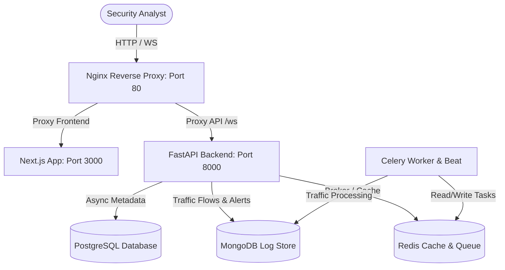

# NetShield AI Security Operations Center (SOC) Platform

NetShield AI is a state-of-the-art, AI-powered Security Operations Center (SOC) platform designed for real-time network anomaly detection, traffic monitoring, threat alerting, and access management. 

It provides security analysts with a powerful, dynamic dashboard featuring live WebSocket-driven traffic monitoring, threat logging, automated alerting, and granular role/team controls.

---

## 🏗️ System Architecture

NetShield AI is constructed using a decoupled microservices architecture. Here is a high-level visualization of the service interaction:



### Stack Components
1. **Frontend**: Next.js (TypeScript, TailwindCSS, Chart.js, Shadcn UI) providing a responsive and modern user interface. Runs with Webpack to ensure build stability.
2. **Backend**: FastAPI (Python 3.12, SQLAlchemy, Motor, Asyncio) supplying high-performance REST APIs and WebSocket endpoints for real-time telemetry.
3. **Database Layer**:
    *   **PostgreSQL**: Handles structural entities (Users, Roles, Teams, Audits, Core Settings). Falls back to **SQLite** in default local dev environments.
    *   **MongoDB**: Optimally stores massive quantities of network traffic items, threat simulations, and log data.
    *   **Redis**: Serves as Celery task broker, results store, and application-level API rate-limiting cache.
4. **Reverse Proxy**: Nginx orchestrates incoming traffic, routing requests seamlessly to either the Next.js development server or the FastAPI backend API router.
5. **Background Processor**: Celery (Worker & Beat) runs asynchronous workers for scheduled network traffic anomaly scans and threat modeling calculations.

---

## 📁 Repository Structure

```text
gowtham4201/
├── backend/                   # Python FastAPI service
│   ├── app/                   # Core application codebase
│   │   ├── api/               # API Router endpoints (auth, users, traffic, audit...)
│   │   ├── core/              # Database setups, configs, security policies
│   │   ├── models/            # SQLAlchemy schemas & MongoDB schemas
│   │   ├── tasks/             # Celery background tasks
│   │   └── websocket/         # Real-time WebSocket handlers
│   ├── alembic/               # PostgreSQL schema migration history
│   ├── tests/                 # Unit & API testing suite
│   ├── Dockerfile
│   └── requirements.txt
├── frontend/                  # Next.js web application
│   ├── src/                   # React components, contexts, and pages
│   │   ├── components/        # Reusable Tailwind & Shadcn widgets
│   │   ├── hooks/             # Custom state & connection hooks
│   │   └── pages/             # App page views and routers
│   ├── package.json
│   └── tsconfig.json
├── docker/                    # Service-specific configurations (Nginx, postgres, mongo)
├── scripts/                   # System simulation and administration tooling
│   ├── seed_db.py             # Enters mock telemetry data
│   ├── create_admin.py        # Generates a primary Super-Admin user
│   └── generate_traffic.py    # Emulates live network traffic patterns
├── docker-compose.yml         # Defines multi-container developer setup
└── Makefile                   # Shortcuts for command execution
```

---

## 🛠️ Step-by-Step Installation & Quickstart

You can bring NetShield AI online either via **Docker Compose (Recommended)** or by running **services locally**.

### Step 0: General Setup (Required for Both)
Clone the repository and copy the environment template:
```bash
# 1. Copy the example configuration to active env
cp .env.example .env
```
*(Make sure to open `.env` and review credentials or ports if you have custom configurations. For general local dev or running in Docker, the defaults will work out-of-the-box).*

---

### Option A: Running with Docker (Recommended)
This approach automatically installs and launches PostgreSQL, MongoDB, Redis, pgAdmin, Mongo Express, FastAPI Backend, Celery, and Nginx.

#### 1. Build and Run Container Stack
In the root directory, run:
```bash
docker compose up --build -d
```
*(Or use script shortcut: `make build` then `make up`)*

#### 2. Execute DB Migrations
Generate tables in your PostgreSQL container:
```bash
docker compose exec backend alembic upgrade head
```
*(Or use script shortcut: `make migrate`)*

#### 3. Seed Database & Generate Admin Credentials
Simulate mock security intelligence data and spawn a root login account:
```bash
docker compose exec backend python -m scripts.seed_db
docker compose exec backend python -m scripts.create_admin
```
*(Or use script shortcuts: `make seed` and `make admin`)*

#### 4. Verify Services
Open your browser and navigate to:
*   🖥️ **SOC Frontend**: [http://localhost](http://localhost)
*   🔑 **Backend Swaggers**: [http://localhost/api/docs](http://localhost/api/docs)
*   🗃️ **pgAdmin Panel**: [http://localhost:5050](http://localhost:5050)
*   🍃 **Mongo Express**: [http://localhost:8081](http://localhost:8081)

---

### Option B: Running Locally (For Active Development)

If you prefer building and debugging servers directly on your operating system:

#### 1. Confirm Local Instances
Ensure you have active local services listening on their default ports:
*   PostgreSQL on `5432` (or SQLite `netshield.db` will be auto-generated in `backend/` as backup)
*   MongoDB on `27017`
*   Redis on `6379`

In `.env`, set `POSTGRES_HOST=localhost`, `MONGO_HOST=localhost`, and `REDIS_HOST=localhost`.

#### 2. Build and Launch Backend (API)
Open a new workspace terminal in the project root:
```bash
# Move to backend folder
cd backend

# Create Python virtual environment
python -m venv venv

# Activate virtual environment
# On Windows (PowerShell):
.\venv\Scripts\Activate.ph1
# On Windows (CMD):
.\venv\Scripts\activate.bat
# On macOS/Linux:
source venv/bin/activate

# Install requirements
pip install --upgrade pip
pip install -r requirements.txt

# Run migrations to initialize db schemas
alembic upgrade head

# Seed initial admin and mock network threats
python -m scripts.seed_db
python -m scripts.create_admin

# Start FastAPI server
uvicorn app.main:app --host 0.0.0.0 --port 8000 --reload
```

#### 3. Run Celery Background Workers (Optional)
In a separate terminal (with virtual environment activated in `backend/`):
```bash
# Start background queue tasks
celery -A app.tasks.celery_app worker --loglevel=info
```
And to trigger scheduled scans:
```bash
# Start Celery periodic beat timer
celery -A app.tasks.celery_app beat --loglevel=info
```

#### 4. Build and Launch Frontend (Web App)
Open another terminal:
```bash
# Navigate to NextJS workspace
cd frontend

# Install package dependencies
npm install

# Run Frontend using Webpack configuration (forces stable performance)
npm run dev
```

#### 5. Verify Local Services
Open your database clients and browsers to:
*   🖥️ **SOC Frontend**: [http://localhost:3000](http://localhost:3000)
*   🔑 **Backend APIs**: [http://localhost:8000/api/docs](http://localhost:8000/api/docs)

---

## 🚗 Telemetry Simulation
To test the threat monitoring charts and live metrics, run the traffic generator script in the backend terminal:
```bash
# In backend virtual environment
python -m scripts.generate_traffic
```
This script constantly pushes mock anomalies, warning indicators, and harmless normal connection logs into MongoDB, feeding real-time charts in the React dashboard.

---

## 🧪 Testing Suite
To ensure the backend logic and routers are functioning properly, execute the tests:
```bash
# Using Makefile (Docker based)
make test

# Or locally (inside backend directory with venv)
pytest -v
```

---

## 🛠️ Handy Makefile Shortcuts
If you are developing inside Docker, here is a list of convenient shortcuts:

*   `make build` - Rebuilds docker images.
*   `make up` - Launches the container cluster in background.
*   `make down` - Shuts down matching docker containers.
*   `make restart` - Performs full restart cycle.
*   `make logs` - Tracks real-time output streams from all containers.
*   `make logs-backend` - Stream logs from FastAPI.
*   `make logs-frontend` - Stream logs from NextJS.
*   `make seed` - Seeds Postgres & Mongo with starting simulation data.
*   `make admin` - Spawns admin dashboard credentials.
*   `make test` - Triggers automatic Pytest suites.
