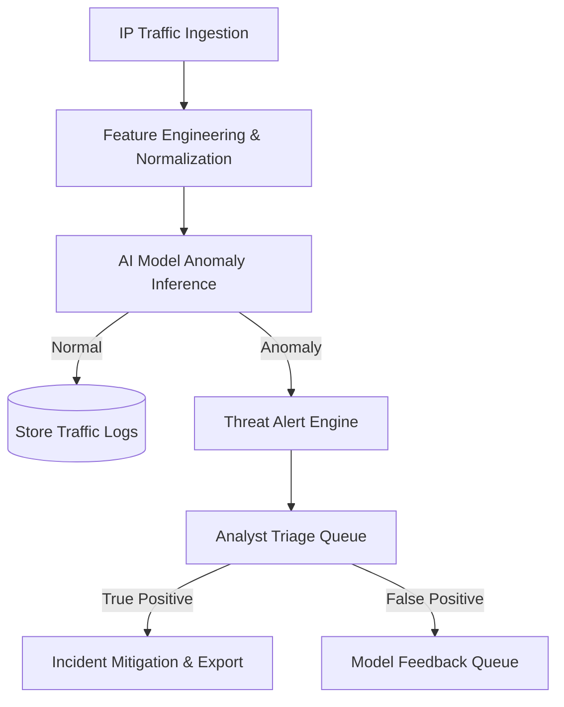

# NetShield AI: Security Monitoring Objectives & Cybersecurity Workflows

This document defines the Security Operations Center (SOC) monitoring objectives and core cybersecurity workflows implemented in the NetShield AI platform.

---

## 🎯 Security Monitoring Objectives

The primary objective of NetShield AI is to provide continuous visibility, real-time threat detection, and mitigation of network traffic anomalies. This is aligned with the core tenets of information security:

### 1. Confidentiality (Data Leakage & Intrusion Detection)
- **Objective**: Identify unauthorized attempts to access or exfiltrate network data.
- **Monitoring Scope**: Detect ssh/rdp port scanning, brute-forcing attempts, and unauthorized data replication.

### 2. Integrity (System & Traffic Integrity)
- **Objective**: Ensure that network traffic flows have not been modified or spoofed.
- **Monitoring Scope**: Detect DNS spoofing, payload modifications, and audit logs tampering.

### 3. Availability (Denial-of-Service / Resource Starvation)
- **Objective**: Maintain service uptime and detect bandwidth/resource exhaustion.
- **Monitoring Scope**: Detect high-volume traffic flows, SYN floods, UDP floods, and distributed denial-of-service (DDoS) patterns.

---

## 🔄 SOC Cybersecurity Workflows

NetShield AI structures cybersecurity incident detection, analysis, and response into a set of sequential workflows:

### Workflow 1: Real-time Ingestion & Normalization
1. **Intake**: Network sensors stream packet metadata (flow logs) into MongoDB.
2. **Parsing**: The ingest processor parses standard IP metrics (source IP, destination IP, protocols, packet size, flags, duration).
3. **Storage**: Complete history is recorded to the MongoDB `traffic_logs` collection for historical analytics.

### Workflow 2: Automated Threat Inference & Alerting
1. **Calculation**: Ingested packets are evaluated by the AI inference engine (Isolation Forest / Random Forest models).
2. **Analysis**: Outlier scores are computed.
3. **Escalation**: Entries exceeding the threshold trigger a new log event in the mongo alerts collection and are pushed to the live WebSocket dashboard.

### Workflow 3: Analyst Incident Triage
1. **Notification**: The SOC analyst sees live alerts appear on the dashboard.
2. **Inspection**: The analyst inspects detail modals (ports, geo-location, payload hex dumps, flags).
3. **Resolving Status**:
   - **Scenario A (True Threat)**: Analyst opens a ticket, assigns the issue to the relevant team (e.g., Red Team / Blue Team), and takes network shielding actions (firewall block).
   - **Scenario B (False Alarm)**: Analyst completes a review, logs the alert as a false positive, and updates system settings.
